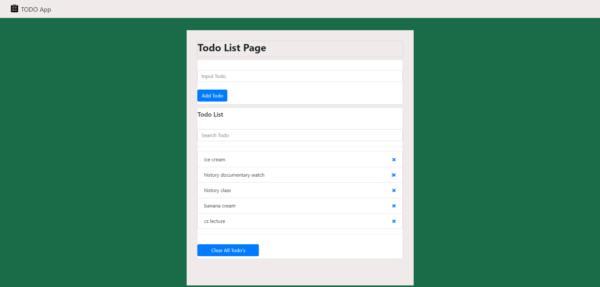

# TODO App



This is a simple TODO application built with HTML, CSS, JavaScript, and Bootstrap. It allows users to add, filter, remove, and clear TODO items. The application also saves TODO items to the local storage, so they persist even after the page is refreshed.


## Table of Contents

- [Features](#features)
- [Installation](#installation)
- [Usage](#usage)
- [Code Explanation](#code-explanation)
- [License](#license)

## Features

- Add new TODO items
- Remove individual TODO items
- Clear all TODO items
- Filter TODO items
- Persist TODO items in local storage

## Installation

1. Clone the repository:

    ```bash
    git clone https://github.com/KaanAy14/Todo-List-Project.git
    ```

2. Open the project directory:

    ```bash
    cd Todo-List-Project
    ```

3. Open `index.html` in your preferred web browser.

## Usage

1. **Add a TODO**:
    - Type your TODO item into the input field under "Input Todo".
    - Click the "Add Todo" button or press Enter to add the TODO item to the list.

2. **Remove a TODO**:
    - Click the trash icon (`<i class="fa fa-remove"></i>`) next to the TODO item you want to remove.

3. **Clear All TODOs**:
    - Click the "Clear All Todo's" button to remove all TODO items from the list.

4. **Filter TODOs**:
    - Type your search term into the "Search Todo" input field to filter the list of TODO items.

## Code Explanation

### HTML

The HTML file includes the structure of the TODO app, with a navbar, input forms for adding and filtering TODOs, and a list to display the TODO items.

### CSS

The CSS is mainly provided by Bootstrap for styling and layout, with some custom styles defined in the `style` attributes.

### JavaScript

The `app.js` file contains the main logic for the TODO app:

- **Event Listeners**: Set up event listeners for adding, removing, filtering, and clearing TODO items.
- **Local Storage**: Functions to save and load TODO items from the local storage.
- **DOM Manipulation**: Functions to update the UI based on user actions.

### Functions

- `runEvents()`: Sets up all the event listeners.
- `filter(e)`: Filters the TODO items based on the search input.
- `clearAllTodos()`: Clears all TODO items from the UI and local storage.
- `removeTodoFromStorage(todoToRemove)`: Removes a TODO item from local storage.
- `removeTodoFromUI(todoElement)`: Removes a TODO item from the UI.
- `removeTodo(e)`: Handles the removal of a TODO item.
- `loadPage()`: Loads the TODO items from local storage when the page is loaded.
- `addTodoToStorage(newTodo)`: Adds a new TODO item to local storage.
- `addTodoToUI(newTodo)`: Adds a new TODO item to the UI.
- `addTodo(e)`: Handles adding a new TODO item.
- `checkTodosFromStorage()`: Checks and retrieves TODO items from local storage.
- `showAlert(type, message)`: Displays alert messages for feedback.

## License

This project is licensed under the MIT License.
